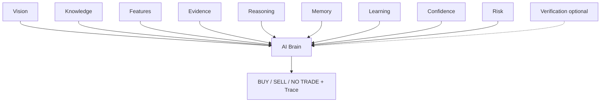

# AI Brain (Phase 10)

Central decision coordinator. **Never analyzes raw images. Never detects structures.**

## Role



The Brain **orchestrates** engines. It does not duplicate their work.

## Decision flow

1. Receive validated engine outputs  
2. Check completeness (poor quality → request better screenshot)  
3. Detect conflicts (HTF disagreement → prefer NO TRADE)  
4. Search historical memory (influences confidence, never overrides chart bias alone)  
5. Evaluate confidence + risk  
6. Self-check  
7. Prefer **NO TRADE** over low-quality recommendations  
8. Emit explanation + reason trace  

## Determinism

Same validated inputs → same `deterministic_hash` and recommendation.

## Output

Pair, timeframes, summary, bias, entry/SL/TP/RR, confidence, trade grade,  
supporting/conflicting evidence, historical support, warnings, explanation, reason trace.

## API

| Method | Path |
|--------|------|
| POST | `/api/brain/recommend` |
| POST | `/api/analyze` / `/api/decide` | Routed through AI Brain |

## Package

```
brain/
  models.py
  completeness.py
  conflicts.py
  historical.py
  self_check.py
  trace_store.py
  coordinator.py   # AIBrain
  ARCHITECTURE.md
```

Traces: `backend/storage/brain_traces/`
