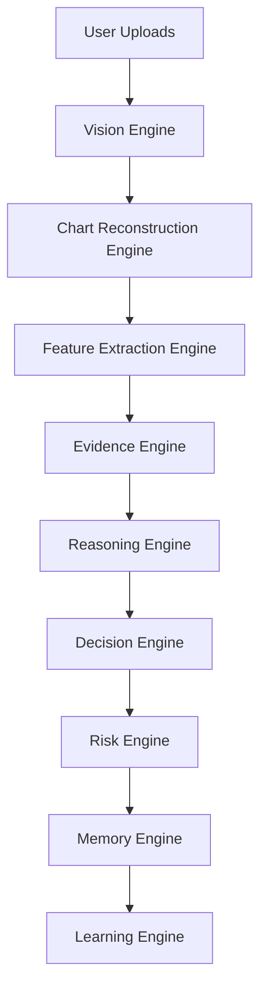

# Cognitive AI Architecture (Phase 6)

Evidence-based reasoning. No black box. Insufficient evidence → **NO TRADE**.

## Master pipeline



Data flow detail:


## Engines

| # | Engine | Input | Output |
|---|--------|-------|--------|
| 1 | Vision | Screenshot | `ChartModel` |
| 2 | Chart Reconstruction | `ChartModel` | `MarketModel` |
| 3 | Feature Extraction | `MarketModel` | `FeatureCollection` |
| 4 | Evidence | `FeatureCollection` | `Evidence` |
| 5 | Reasoning | Multi-TF `Evidence` | `ReasoningReport` |
| 6 | Decision | Report + Risk | `CognitiveDecision` |
| 7 | Risk | Report + Markets | `RiskAssessment` |
| 8 | Memory | Decision + charts | Permanent archive |
| 9 | Learning | Outcomes | Feature weight updates |

## Interfaces

All engines implement Protocols in `cognitive/interfaces.py`.  
Wire via `CognitiveContainer` (dependency injection).  
Replace one engine without modifying others.

## Events

`EventBus` (`cognitive/events.py`) publishes:

- `vision.done`, `market.rebuilt`, `features.extracted`
- `evidence.built`, `reasoning.done`, `decision.made`
- `risk.assessed`, `memory.stored`, `learning.updated`

## No black box rules

1. Never invent missing structures — mark **Unknown** / list in `missing`.
2. Every confidence score has a `trace` dict (penalties, scores, bias).
3. Every decision has a `reproducible_hash`.
4. Evidence items carry `trace_id` and `rationale`.
5. Always **NO TRADE** when evidence, margin, confidence, image quality, HTF conflict, or RR fails gates.
6. Evidence records **supporting** and **conflicting** structures explicitly.

## Package layout

```
backend/cognitive/
  models/          # MarketModel, FeatureCollection, Evidence, ReasoningReport, …
  engines/         # Nine independent engines
  interfaces.py    # Protocols
  events.py        # Event bus
  weights.py       # Default feature weights (learning adjusts)
  container.py     # DI
  pipeline.py      # Master orchestration
  ARCHITECTURE.md  # This file
  STEP4_NOTES.md   # Evidence Engine hardening notes
```

Prior phases (`cv/`, `core/`, `decision/`, `memory/`) are **backends**, not rewritten.

## API

| Method | Path | Purpose |
|--------|------|---------|
| POST | `/api/cognitive/reason` | Full cognitive trail (no persist) |
| POST | `/api/cognitive/evidence/evaluate` | FeatureCollection → Evidence + report |
| POST | `/api/cognitive/reasoning/from-evidence` | Multi-TF Evidence → ReasoningReport |
| POST | `/api/cognitive/decision/from-reasoning` | Reasoning + Risk → CognitiveDecision |
| POST | `/api/analyze` | App path — cognitive pipeline → UI schema |
| POST | `/api/decide` | Persisted TradeDecision via cognitive pipeline |
