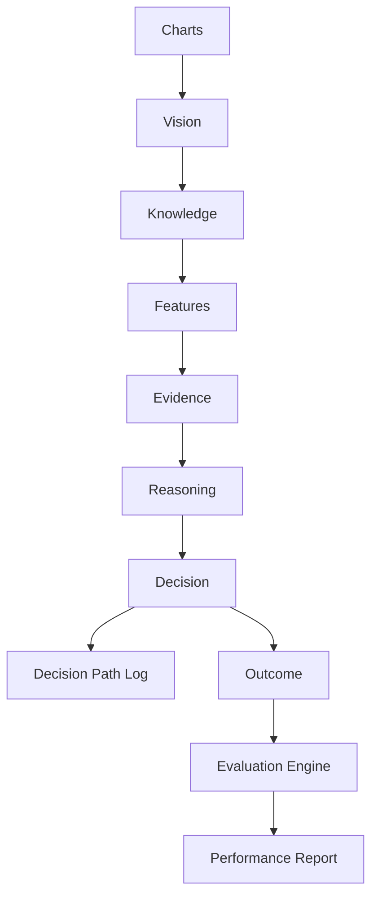

# Evaluation & Validation Framework (Phase 9)

Objective measurement of every AegisAI module.  
**Improvements are accepted only when evaluation shows measurable gains.**

## Pipeline



## Metrics

| Area | Key metrics | Calculation notes |
|------|-------------|-------------------|
| Vision | accept/reject, avg confidence, pair/TF/structure known, unknowns | Counters from chart analysis status |
| Features | detection rates for trend/BOS/CHOCH/liquidity/OB/FVG/supply/demand, unknown rate | `detections / analyses` |
| Knowledge | validated vs rejected, unknown rate | Knowledge validation outcomes |
| Evidence | avg buy/sell/neutral weights, consistency | Dominant mass / total mass |
| Decisions | BUY/SELL/NO TRADE counts, avg confidence, RR, confidence bins | Decision counters |
| Calibration | gap, factor, bins | From research calibration engine |
| Trade review | wins/losses, avg scorecard fields | From `research_reviews` |
| Learning | pattern updates, lessons, memory growth, similarity searches | Counters + DB counts |

## Health grades

| Score | Grade |
|------|-------|
| ≥ 85 | Excellent |
| ≥ 70 | Good |
| ≥ 55 | Improving |
| ≥ 40 | Needs Review |
| > 0 | Critical |
| 0 / no data | Unknown |

## Quality gates

A candidate must improve the baseline score by at least **2.0** points (configurable) to be accepted.  
A/B tests store historical results; rejected candidates never become default silently.

## Decision path log

Every recommendation stores:

- Input summary
- Validated concepts
- Evidence summary
- Reasoning summary
- Decision + confidence
- Knowledge version
- Outcome + review scores (when available)

## API

| Method | Path |
|--------|------|
| GET | `/api/evaluation/dashboard` |
| GET | `/api/evaluation/report` |
| GET | `/api/evaluation/reports` |
| GET | `/api/evaluation/health` |
| GET | `/api/evaluation/paths` |
| POST | `/api/evaluation/gates/check` |
| POST | `/api/evaluation/ab/start` |
| POST | `/api/evaluation/ab/{id}/complete` |

## Package

```
evaluation/
  models.py
  database.py
  counters.py
  path_logger.py
  metrics.py
  health.py
  quality_gates.py
  engine.py
  dashboard.py
  ARCHITECTURE.md
  METRICS.md
```
