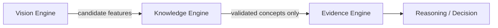

# Trading Knowledge Base (Phase 8)

Authoritative, versioned Smart Money Concepts rules — **separate from AI logic**.

## Integration



Analyses stamp `Knowledge version: 1.0` so rule changes never silently rewrite history.

## Versioning

| Version | Status |
|---------|--------|
| **1.0** | Current |

Prior versions remain loadable via `KnowledgeEngine(version="1.0")`.  
Future refinements add new version modules under `knowledge/catalog/` without deleting old ones.

## API

| Method | Path |
|--------|------|
| GET | `/api/knowledge/version` |
| GET | `/api/knowledge/meta` |
| GET | `/api/knowledge/concepts` |
| GET | `/api/knowledge/concepts/{id}` |
| GET | `/api/knowledge/relationships` |
| POST | `/api/knowledge/validate` |
| POST | `/api/knowledge/validate/features` |

Unknown `version` query/body values return **HTTP 404** (never 500).

## Brain wiring

`AIBrain._build_bundle` treats Vision flags as candidates and only appends
`validated_concepts` entries when `KnowledgeEngine.validate_concept` returns
`status == "valid"`. Raw BOS/CHOCH/OB flags are never stamped as validated
without catalog rules.

## Package

```
knowledge/
  models.py          # ConceptDefinition, ValidationResult, …
  versioning.py      # CURRENT_VERSION, VERSION_LOADERS
  catalog/v1_0.py    # All concept + relationship definitions
  registry.py        # Load / cache catalogs
  conditions.py      # Declarative condition evaluator
  validator.py       # Validate features against rules
  engine.py          # Public KnowledgeEngine API
  CONCEPTS.md        # Human-readable concept docs
  ARCHITECTURE.md    # This file
```

## Rules

1. Never mark a concept detected unless validation passes.
2. Incomplete evidence → **Unknown** (never guess).
3. Relationships never guarantee a trade.
4. Existing analyses keep their knowledge version reference.
