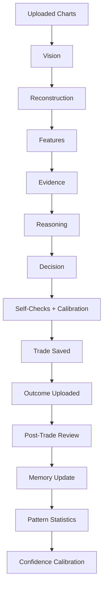

# Research Platform (Phase 7)

Explainable continuous improvement. Improves **analysis quality**, not win-chasing.

## Pipeline

## Components

| Module | Role |
|--------|------|
| `self_checks.py` | Pre-decision gates (evidence, conflicts, NO TRADE preference, pattern, confidence) |
| `post_trade_review.py` | Review report + research scorecard |
| `decision_quality.py` | Excellent→Avoid — **independent of win/loss** |
| `confidence_calibration.py` | Predicted vs realized bins; gradual factor |
| `pattern_library.py` | Feature-combo stats (wins/losses/no-trade/RR/holding) |
| `lesson_engine.py` | Permanent concise lessons |
| `dashboard.py` | Research dashboard aggregates |
| `analysis_cache.py` | Immutable analysis cache (indexed) |
| `orchestrator.py` | Wires gates + outcome processing |

## Interfaces

See `research/interfaces.py`. Engines are independently replaceable.

## API

| Method | Path |
|--------|------|
| GET | `/api/research/dashboard` |
| POST | `/api/trades/{id}/outcome` (includes research block) |

## Performance

- SQLite WAL + indexes on memories, patterns, reviews, lessons, cache
- Analysis cache keyed by image content hash
- Calibration / pattern updates are O(1) upserts

## Rules

1. Never hide reasoning — reviews, traces, and lessons are stored.
2. Never overwrite history — counters only increment.
3. Never calibrate from one trade — `MIN_SAMPLES_FOR_ADJUSTMENT = 25`.
4. Decision quality ≠ P&L.
