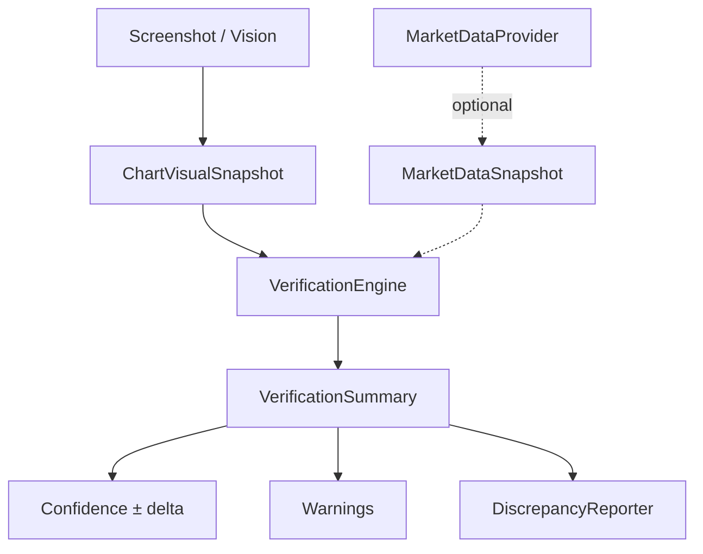

# Market Data Verification (Phase 11)

Optional layer that compares **screenshot reconstruction** with **OHLC market data**.

Screenshot analysis remains primary and independent. Market data is never required.

## Role



## Rules

1. Never require market data to complete an analysis.
2. If data is unavailable → continue with screenshots; warn clearly.
3. Verification **strengthens or weakens confidence** — never replaces visual bias.
4. Significant disagreement → reduce confidence + record discrepancies.
5. Providers are pluggable (no single broker/vendor dependency).

## Confidence influence

| Outcome | Typical influence |
|---------|-------------------|
| Screenshot only / unavailable / error | `0` |
| Strong match (`verified_match`, score ≥ 80) | up to **+5** |
| Partial agreement | up to **+3** |
| Significant conflict | up to **−15** |

Caps live in `verification/confidence.py`. Historical memory (±8) and verification are additive with the chart scorecard.

## Provider interface

```python
class MarketDataProvider(Protocol):
    @property
    def name(self) -> str: ...
    def available(self) -> bool: ...
    def fetch(self, pair, timeframe, *, end_time=None, limit=100) -> MarketDataSnapshot | None: ...
```

Built-ins:

| Provider | Role |
|----------|------|
| `NullMarketDataProvider` | Default — screenshot only |
| `InMemoryMarketDataProvider` | Tests / offline fixtures |

Swap without touching the Decision Engine:

```python
brain = AIBrain(market_provider=InMemoryMarketDataProvider(...))
# or
brain = AIBrain(verification=VerificationEngine(provider=MyBrokerAdapter()))
```

## Comparison checks

When both screenshot and OHLC are present:

- Detected timeframe / pair  
- Trend  
- Swing structure  
- Recent highs / lows  
- Approximate candle sequence  
- Missing candles / stale image age  

## Package

```
verification/
  models.py          # OHLC, snapshots, VerificationSummary, Discrepancy
  provider.py        # Protocol + Null + InMemory
  visual.py          # ChartVisualSnapshot builders
  engine.py          # VerificationEngine
  confidence.py      # influence_on_confidence
  discrepancy.py     # DiscrepancyReporter + storage
  ARCHITECTURE.md
```

Discrepancies: `backend/storage/verification_discrepancies/`

## API

| Method | Path |
|--------|------|
| POST | `/api/verification/check` |
| GET | `/api/verification/discrepancies` |
| GET | `/api/verification/health` |

`/api/analyze` and `/api/brain/recommend` remain screenshot-first; with the default Null provider they annotate **screenshots only**.
